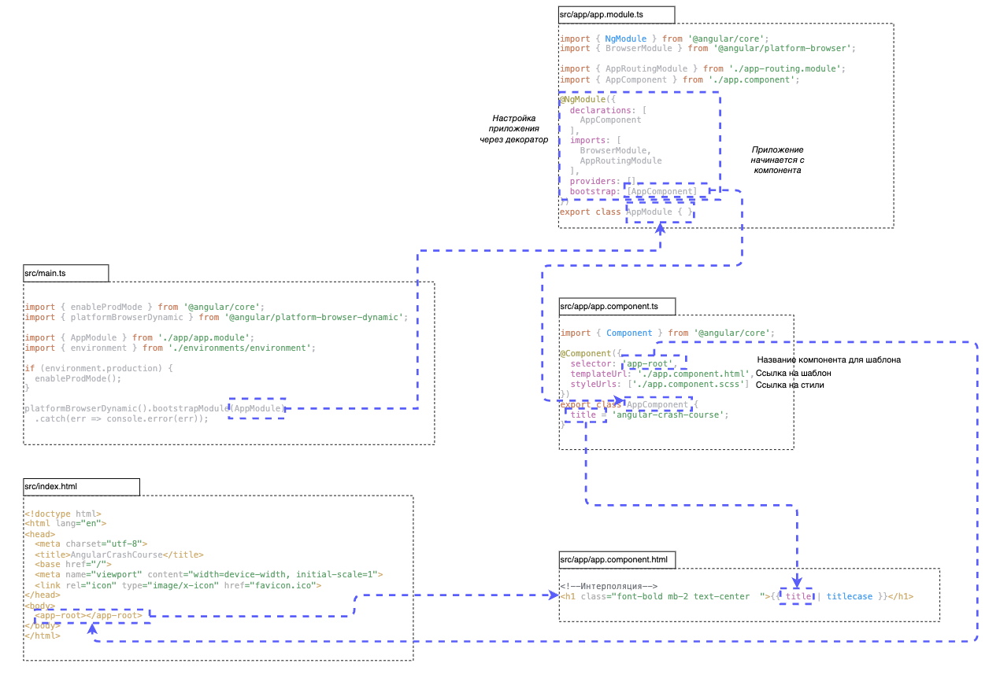

# Guide

- https://www.youtube.com/watch?v=yCIti018Srw
- https://v14.angular.io/guide/setup-local




# Install

Устанавливаем локально

```
yarn add @angular/cli@14
```

Проверяем версию

```
./node_modules/@angular/cli/bin/ng.js version
```

Добавляем алиас - т.к. angular установлен локально определяем алиас для конкретной директории. Далее для скриптов запуска нам понадобится алиас `ng`
```
sudo vim ~/.zshrc

# Определите директорию, в которой будут работать алиасы
TARGET_DIR="/Users/yury/Documents/Projects/Pets/202502_angular"

# Функция, которая будет выполняться при смене директории
function chpwd() {
    if [[ "$PWD" == "$TARGET_DIR" ]]; then
        # Установите алиасы
        alias ng=/Users/yury/Documents/Projects/Pets/202502_angular/node_modules/@angular/cli/bin/ng.js
        # Добавьте другие алиасы по необходимости
    else
        # Удалите алиасы, если вы не в целевой директории
        unalias ng 2>/dev/null
        # Удалите другие алиасы по необходимости
    fi
}

# Вызовите функцию сразу, чтобы установить алиасы при запуске терминала
chpwd
```

Проверяем
```
ng version

     _                      _                 ____ _     ___
    / \   _ __   __ _ _   _| | __ _ _ __     / ___| |   |_ _|
   / △ \ | '_ \ / _` | | | | |/ _` | '__|   | |   | |    | |
  / ___ \| | | | (_| | |_| | | (_| | |      | |___| |___ | |
 /_/   \_\_| |_|\__, |\__,_|_|\__,_|_|       \____|_____|___|
                |___/


Angular CLI: 14.2.13
Node: 22.13.0 (Unsupported)
Package Manager: yarn 1.22.22
OS: darwin x64

Angular: undefined
...

Package                      Version
------------------------------------------------------
@angular-devkit/architect    0.1402.13
@angular-devkit/core         14.2.13
@angular-devkit/schematics   14.2.13
@angular/cli                 14.2.13
@schematics/angular          14.2.13
```

Документация
```
ng --help
```

Создаем новый проект
```
ng new angular-crash-course

? Would you like to add Angular routing? Yes
? Which stylesheet format would you like to use? SCSS   
[ https://sass-lang.com/documentation/syntax#scss                ]
```

# Стили

https://v3.tailwindcss.com/docs/installation


```
yarn add tailwindcss @tailwindcss/postcss postcss
```

Конфиг
```
tsconfig.json

{
  "angularCompilerOptions": {  
	// ...
    "skipLibCheck": true  
  }  
}
```
# Запускаем

```
yarn start
```

Найти не завершенные экземпляры
```
sudo lsof -iTCP -sTCP:LISTEN -n -P | grep node
kill -9 pid
```

# Запуск из репозитория

```shell
git clone git@github.com:yury-nazarov/angular-example.git
cd angular-example
yarn install
```


